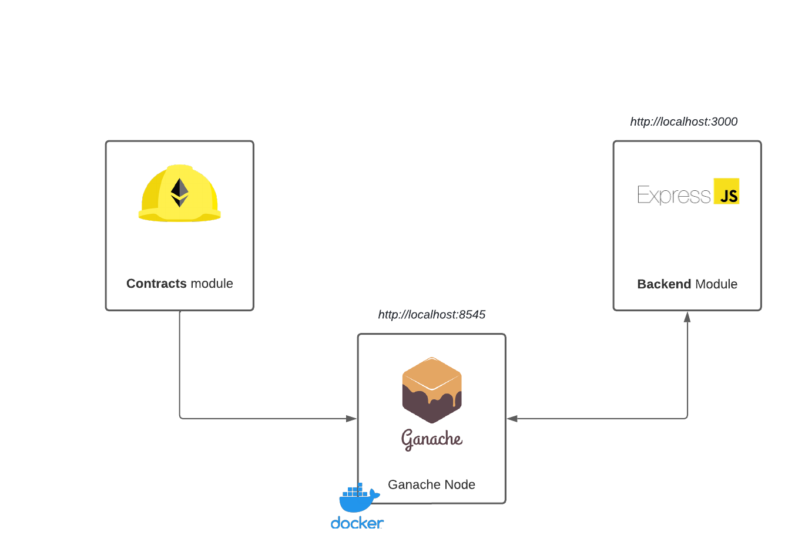

# Human Protocol test

This project contains a hardhat and nodeJS projects with the blockchain interaction.

Contracts:
- ***HumanProtocolStaking*** => Staking contract, to be able to create new escrows.
- ***StakingRewardsPool*** => Rewards to distribute the slashed tokens of bad actors
- ***MyToken***=> Standard ERC20 token to interact with staking
- ***Escrow*** => copy of Human Protocol Escrow contract
- ***EscrowFactory*** => copy of Human Protocol EscrowFactory contract
- ***SafeMath*** => copy of Human Protocol SafeMath contract

## Architecture



## Requisites
- Docker: check official website https://docs.docker.com/get-docker/
- NodeJS + npm: check official website https://nodejs.org/en/

## Installation
1. Run the initial script
	```shell
    run ./build.sh
    ```
2. Create a copy of .env.example and rename it to .env inside the /human-protocol-backend
    ```shell
    cd human-protocol-backend
    cp .env.example .env
    ```
3. Check the console output and copy MyToken address into /human-protocol-backend/.env
	```shell
    ERC20_TOKEN_ADDRESS=XXXXX
    ```
4. Copy HumanProtocolStaking address into /human-protocol-backend/.env
	```shell
    STAKING_CONTRACT_ADDRESS=XXXXX
    ```
5. Run the backend service:
	```shell
    cd human-protocol-backend
	npx nodemon app.js
    ```

Now the application is up & running.

- Ganache is runing on http://localhost:8545
- The Api service is running on http://localhost:3000
	This api has a BasicAuth with these credentials
		- Username: admin
		- Password: human-protocol

## Extra
You can use a postman collection to test it.
- Download link: https://drive.google.com/file/d/1pQFg0MdS9U9mZ4_j_N8k7LapH_UQhUor/view?usp=sharing
